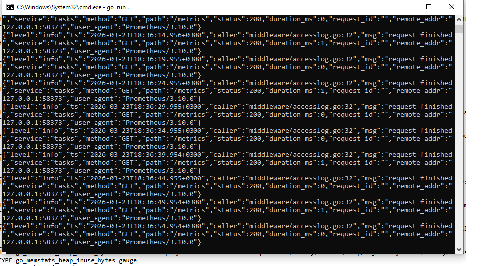
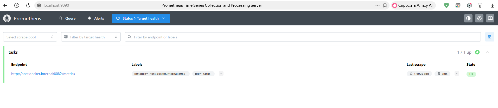
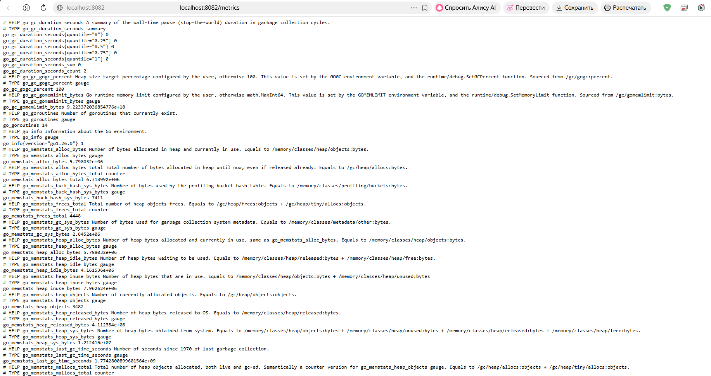
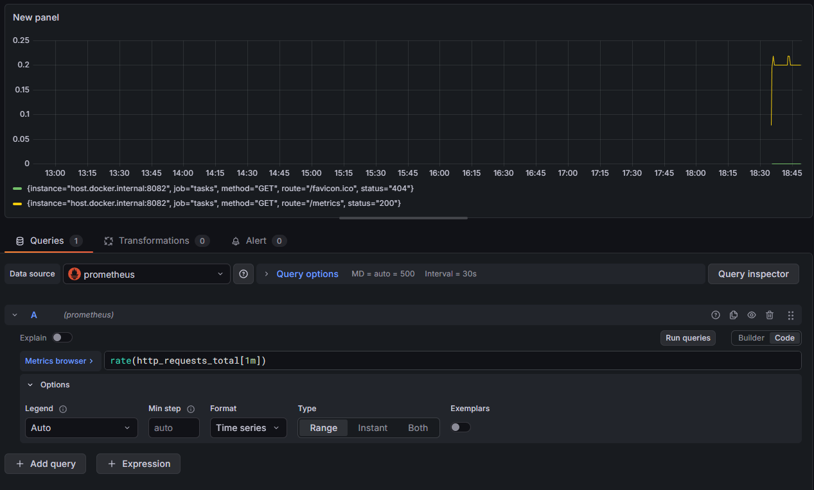
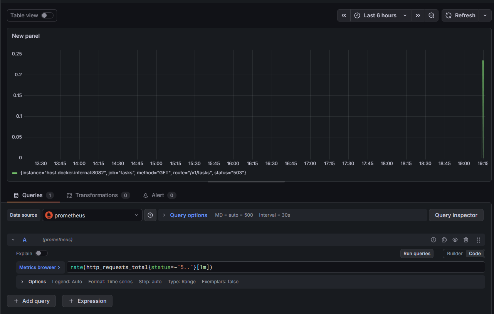
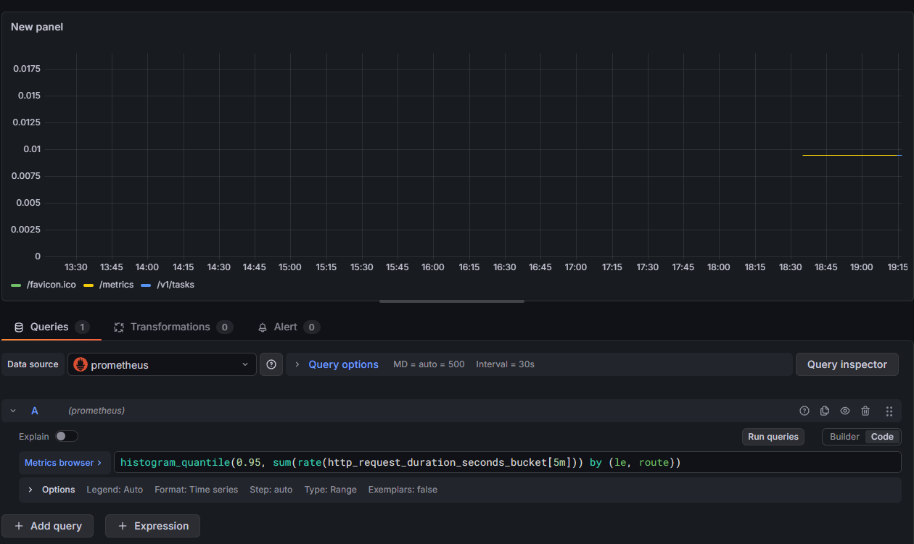

# Практика 4
## Выполнил: Студент ЭФМО-02-25 Фомичев Александр Сергеевич
### Структура:
```
services
    deploy
        monitoring
            prometheus.yml
            docker-compose.yml
    auth
        cmd
            auth
                main.go
        internal
            grpc
                server.go
            http
                handlers
                    login.go
                    verify.go
                routes.go
            service
                auth.go
    tasks
        cmd
            tasks
                main.go
        internal
            metrics
                metrics.go
            grpcclient
                client.go
            http
                middleware
                    metrics.go
                handlers
                    tasks.go
                    middleware
                        auth.go
                routes.go
            service
                tasks.go
shared
    shared
        logger
            logger.go 
    middleware
        requestid.go
        accesslog.go
        grpclog.go
    httpx
        client.go
pkg
    api
        auth
            v1
                auth.proto
                auth.pb.go
                auth_grpc.pb.go
docs
    pz17_api.md
README.md
go.mod
go.sum
```
### описание метрик

http_requests_total (счётчик) – общее количество запросов с метками method, route, status. Используется для расчёта RPS и числа ошибок.

http_request_duration_seconds (гистограмма) – распределение времени обработки запросов. Позволяет вычислять перцентили (p95, p99) для оценки производительности.

http_in_flight_requests (датчик) – текущее число одновременно обрабатываемых запросов. Показывает мгновенную нагрузку на сервис.
    
### Пример вывода /metrics 

**работа task**



**работа task в Prometheus**



**выводd /metrics**


### Графики

**RPS**



**error**



**p95**


